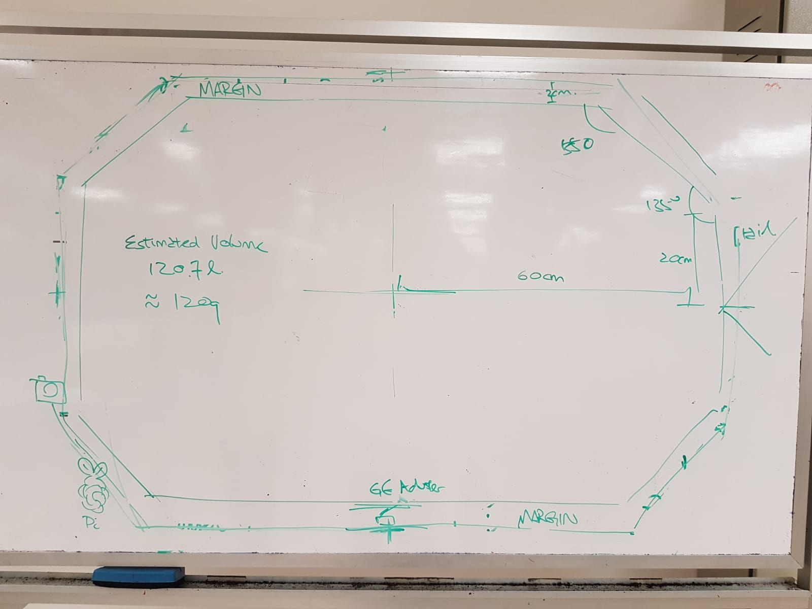
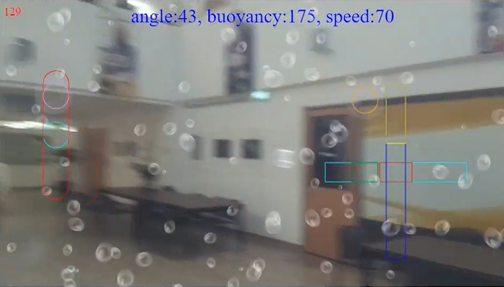

# HoverFish

HoverFish, see it in action [here!](https://www.youtube.com/watch?v=eAWvxgsTUTA&t=54s&ab_channel=JonathanKenny), was a buoyancy based remote controlled drone powered by a Raspberry Pi Zero W+. It was a helium balloon propelled by a distinctive tail, making it [move like a fish in the air](https://www.youtube.com/watch?v=Iow5wQyQOc4&ab_channel=JonathanKenny), hence the name. 

In the summer of my first year at NTU, I enrolled in PS9888 Making and Tinkering, a special term module meant to provide students with the opportunity to solve open-ended real life problems. The module aims to allow students to pick up hands-on expertise in building something which put the knowledge they learnt from their disciplines to practical use.

Having just completed our first year at NTU, the amount of knowledge we had picked up in our respective disciplines may not have been much, but nevertheless we sought to build something ambitious. After much deliberation, we choose to build a balloon drone to explore another approach to flight, as opposed to the now ubiquitous quadcopters.

We began with a rough sizing of the drone as well as looking into the mobility of such a contraption by reverse engineering similar toys we discovered on the internet. To ensure our product's uniqueness, we decided to modernize the concept, adding in a video feed to the drone as well as the ability to control it over local Wi-Fi networks.

The technical aspects I worked on in this project were 
* configuring the raspberry Pi zero controller we used for our project to be accessible through the local Wi-Fi network, 
* writing the python scripts used to communicate and actuate the servos on board the HoverFish,
* wiring the various electronic components together,
* designing the propulsive and buoyancy mechanisms,
* and testing the drone.

Configuring the Raspberry Pi to connect to the local Wi-Fi network was the greatest challenge I faced in the project as setting up the Raspbian OS remotely, setting up the network options and getting past the security protocols on the school's Wi-Fi involved performing a number of steps I still do not quite understand to this day. Nevertheless, with perseverance I was able to get the Raspberry Pi to be remotely accessible from any device connected to the same Wi-Fi network as it.

The scripts used to communicate with the HoverFish was split into two parts, one to send video feed from the HoverFish to the user and one for the user to send commands to the Hoverfish.

The first was a python script which would host a local page with the video feed from the Raspberry Pi camera. Fortunately, the base code to do so was available from the internet, giving me somewhere to start from. Using HTML and JavaScript, I added an overlay to the video feed, which allowed for a touch input system coupled with a backup keyboard input to send commands back to the HoverFish. The input from the user would send HTTPS requests to the Hoverfish which would then be received and translated to servo commands to control the two servo motors on-board the HoverFish. To allow the HoverFish to simultaneously send and receive HTTPS requests and control the servos, I made use of threads.

The propulsive and buoyancy mechanisms were the systems I am proudest of as they make use of mechanical principles to reduce the weight of the mechanisms, reduce the force required from the servo motors, overcoming two major constraints to our design while delivering the desired performance. The buoyancy mechanism made use of a concentrated load, namely the power supply, located away from the main body to shift the cg of the HoverFish, allowing it to tilt up and down. Combined with the thrust located at the back, this allowed the HoverFish to both climb and sink with a single degree of freedom for the propulsive system. The propulsive system was designed from biomimicry, taking inspiration from how a fish swims, hence the name HoverFish. By using a crescent shaped tail, we were able to reduce the drag on the tail, reducing the force required from the tail servo.

More details on the project timeline, development as well as videos of the HoverFish in action can be found at our project blog at [https://blogs.ntu.edu.sg/ps9888-2018-hoverfish/](https://blogs.ntu.edu.sg/ps9888-2018-hoverfish/).